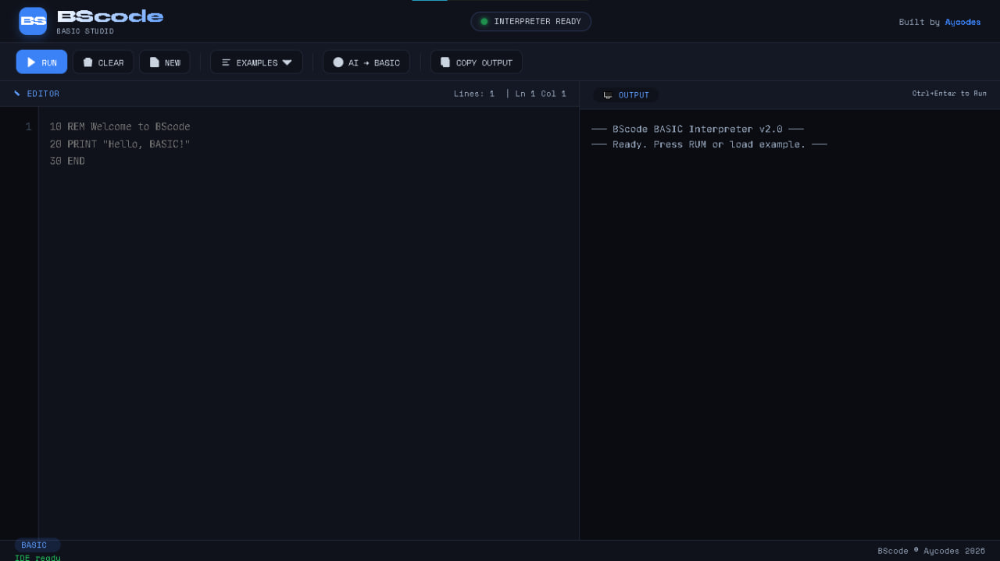

# BScode BASIC IDE

<div align="center">


**Write, Run, and Generate BASIC Code with AI**

[Features](#features) • [Demo](#demo) • [Quick Start](#quick-start) • [Documentation](#documentation) • [Examples](#examples)

</div>

---

## 📖 About

BScode BASIC IDE is a complete web-based development environment for classic BASIC programming. It features a fully functional BASIC interpreter, syntax-aware editor, and an AI-powered code generator that converts natural language descriptions into working BASIC code.

Whether you're learning BASIC, teaching programming concepts, or just nostalgic for the 8-bit era, BScode provides a modern interface for a timeless language.

<div align="center">
  
</div>

---

## ✨ Features

### 🖥️ BASIC Interpreter
- **Full BASIC Language Support** - PRINT, INPUT, IF/THEN/ELSE, FOR/NEXT, GOTO/GOSUB/RETURN
- **Mathematical Functions** - ABS, INT, SQR, RND, MOD, AND, OR, NOT
- **String Operations** - LEN, MID$, LEFT$, RIGHT$, CHR$, ASC, UCASE$, LCASE$
- **Array Support** - DIM statement for single-dimensional arrays
- **Line Number Execution** - Classic line-number based program structure

### 🤖 AI Code Generator
- **Natural Language to BASIC** - Describe what you want, get working code
- **Smart Formatting** - Automatically adds proper line numbers and syntax
- **Instant Generation** - Powered by advanced AI (BScode proprietary engine)
- **Quick Prompts** - One-click templates for common programs

### 🎨 Modern Editor
- **Line Numbers** - Automatic line numbering and cursor tracking
- **Syntax Highlighting** - Clean, readable code presentation
- **Tab Support** - Indent with tab key
- **Live Updates** - Real-time line and column position display

### 📤 Output & Console
- **Interactive Console** - Clear output display with color-coded messages
- **INPUT Support** - Runtime user input handling
- **Copy Output** - One-click copy of console contents
- **Execution Timer** - Shows program runtime

### 📚 Built-in Examples
- Hello World
- Basic Calculator
- Loops and Counters
- Grade Calculator
- Multiplication Table
- Simple Interest Calculator
- Even/Odd Checker
- FizzBuzz
- Prime Number Checker

---

## 🚀 Quick Start

### Option 1: Run Locally

1. **Clone the repository**
```bash
git clone https://github.com/yourusername/BScode.git
cd BScode
```

2. **Open in browser**
```bash
# Just open index.html in your browser
open index.html
# OR use a local server
python -m http.server 8000
```

3. **Start coding!**
   - Type your BASIC program in the editor
   - Press **RUN** to execute
   - Use **BScode AI** to generate code from descriptions

### Option 2: Use Online
Visit the live demo at [your-demo-url.com](https://your-demo-url.com)

---

## 📝 BASIC Language Guide

### Basic Syntax

```basic
10 REM This is a comment
20 PRINT "Hello, World!"
30 INPUT "Enter your name: "; N$
40 PRINT "Hello, "; N$
50 END
```

### Variables
- **Numbers**: A, B, C, TOTAL, SCORE
- **Strings**: A$, NAME$ (trailing $ indicates string)
- **Arrays**: DIM ARR(10) (0-10, 11 elements)

### Control Flow

```basic
' IF Statement
10 IF X > 10 THEN PRINT "Big" ELSE PRINT "Small"

' FOR Loop
20 FOR I = 1 TO 10
30   PRINT I
40 NEXT I

' GOTO
50 IF X < 5 THEN GOTO 20

' GOSUB (subroutine)
60 GOSUB 1000
70 RETURN
```

### Mathematical Operations

```basic
10 LET A = 10 + 5        ' Addition
20 LET B = 20 - 8        ' Subtraction
30 LET C = 6 * 7         ' Multiplication
40 LET D = 100 / 4       ' Division
50 LET E = 17 MOD 5      ' Modulus (remainder: 2)
60 LET F = ABS(-15)      ' Absolute value: 15
70 LET G = INT(3.7)      ' Integer: 3
80 LET H = SQR(16)       ' Square root: 4
```

### String Functions

```basic
10 LET S$ = "Hello World"
20 PRINT LEN(S$)         ' Length: 11
30 PRINT LEFT$(S$, 5)    ' Left 5 chars: "Hello"
40 PRINT RIGHT$(S$, 5)   ' Right 5 chars: "World"
50 PRINT MID$(S$, 7, 5)  ' Middle: "World"
60 PRINT UCASE$(S$)      ' Uppercase: "HELLO WORLD"
70 PRINT LCASE$(S$)      ' Lowercase: "hello world"
```

---

## 🎮 Example Programs

### Area of a Circle

```basic
10 REM Calculate Circle Area
20 INPUT "Enter radius: "; R
30 LET PI = 3.14159
40 LET AREA = PI * R * R
50 PRINT "Area = "; AREA
60 END
```

### Factorial Calculator

```basic
10 REM Factorial Calculator
20 INPUT "Enter number: "; N
30 LET F = 1
40 FOR I = 1 TO N
50   LET F = F * I
60 NEXT I
70 PRINT "Factorial of "; N; " is "; F
80 END
```

### Fibonacci Sequence

```basic
10 REM Fibonacci Sequence
20 INPUT "How many terms? "; N
30 LET A = 0
40 LET B = 1
50 PRINT "Fibonacci: ";
60 FOR I = 1 TO N
70   PRINT A; " ";
80   LET C = A + B
90   LET A = B
100  LET B = C
110 NEXT I
120 PRINT
130 END
```

---

## 🛠️ Technical Details

### Built With
- **Vanilla JavaScript** - No frameworks, pure JS
- **HTML5/CSS3** - Modern responsive design
- **Custom Interpreter** - From-scratch BASIC engine
- **REST API** - AI generation endpoint

### Browser Support
- Chrome (latest)
- Firefox (latest)
- Safari (latest)
- Edge (latest)

---

## 🤝 Contributing

Contributions are welcome! Here's how you can help:

1. **Report Bugs** - Open an issue with detailed reproduction steps
2. **Suggest Features** - Share your ideas for new functionality
3. **Submit PRs** - Fix bugs or add features
4. **Improve Docs** - Help make documentation better

### Development Setup
```bash
# Fork the repo
# Clone your fork
git clone https://github.com/yourusername/BScode.git

# Create a feature branch
git checkout -b feature/amazing-feature

# Make your changes
# Commit and push
git commit -m 'Add amazing feature'
git push origin feature/amazing-feature

# Open a Pull Request
```

---

## 📄 License

Distributed under the MIT License. See `LICENSE` file for more information.

---

## 👨‍💻 Author

**Ayo Codes**
- GitHub: [@ayocodes](https://github.com/Officialay12)

---

## 🙏 Acknowledgments

- Inspired by classic 8-bit BASIC interpreters
- Thanks to all contributors and users
- Built with passion for retro programming

---

## 📞 Support

- **Issues**: [GitHub Issues](https://github.com/Officialay12/BScode/issues)
- **Email**: ayobot70@gmail.com

---

<div align="center">
  <sub>Built by Ayo Codes</sub>
</div>

---

## 🔧 Advanced Usage

### Keyboard Shortcuts
- `Ctrl/Cmd + Enter` - Run program
- `Tab` - Insert indent
- `Esc` - Close AI panel/menus

### Tips & Tricks
1. **Line Numbers** - Always start with 10 and increment by 10 for easy editing
2. **Multiple Statements** - Use `:` to put multiple statements on one line
3. **PRINT Formatting** - Use `;` for no space, `,` for tab spacing
4. **String Concatenation** - Use `;` to join strings and variables
5. **Debugging** - Add `PRINT` statements to trace variable values

---

## 🎯 Roadmap

- [ ] File save/load functionality
- [ ] More string functions
- [ ] Graphics support (canvas)
- [ ] Sound commands
- [ ] Debug mode with step execution
- [ ] Variable watcher panel
- [ ] Code export (HTML, PDF)
- [ ] Mobile responsive improvements

---

**Star ⭐ this repo if you find it useful!**
